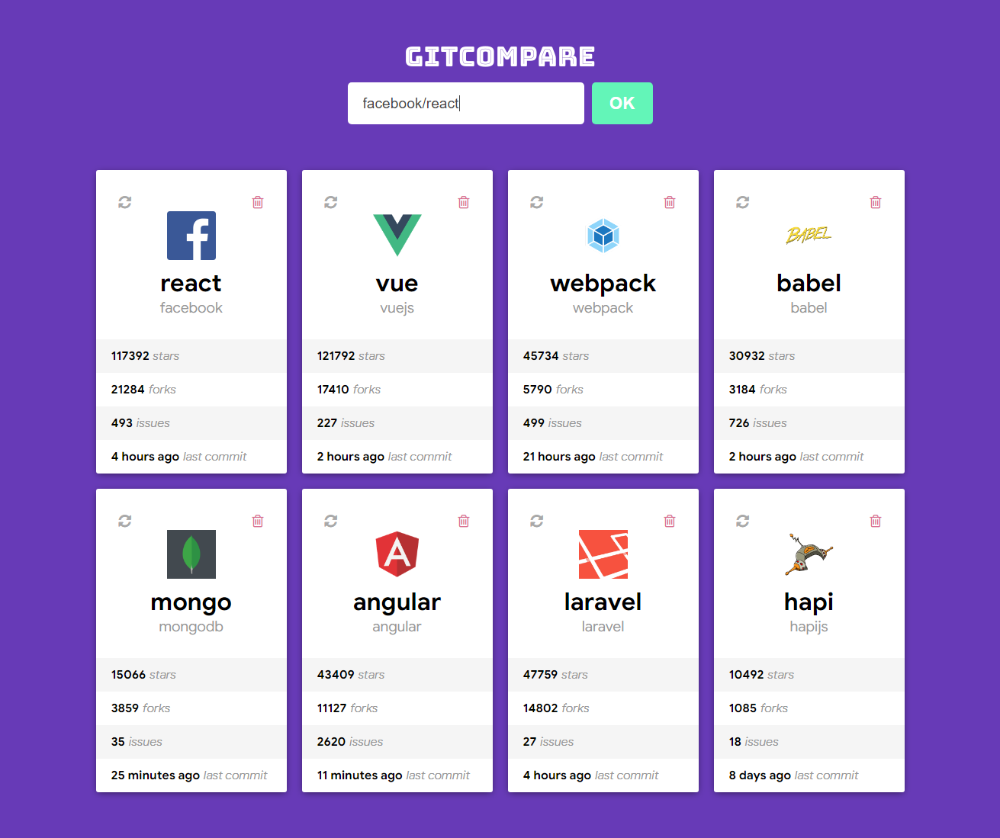

## Add repository

Digite `user/repo` exemplo `facebook/react`

Funcionalidades:

- Adicionar e armazenar a lista de repositórios adicionados ao localStorage;
- Botão em cada repositório para deletar o mesmo da listagem e remova-o do localStorage;
- Botão em cada repositório para atualizar os dados dele buscando as novas informações de stars, forks, last commit, etc;

 

This project was bootstrapped with [Create React App](https://github.com/facebook/create-react-app).

## Available Scripts

In the project directory, you can run:

### `yarn start`

Runs the app in the development mode. 
Open [http://localhost:3000](http://localhost:3000) to view it in the browser.
